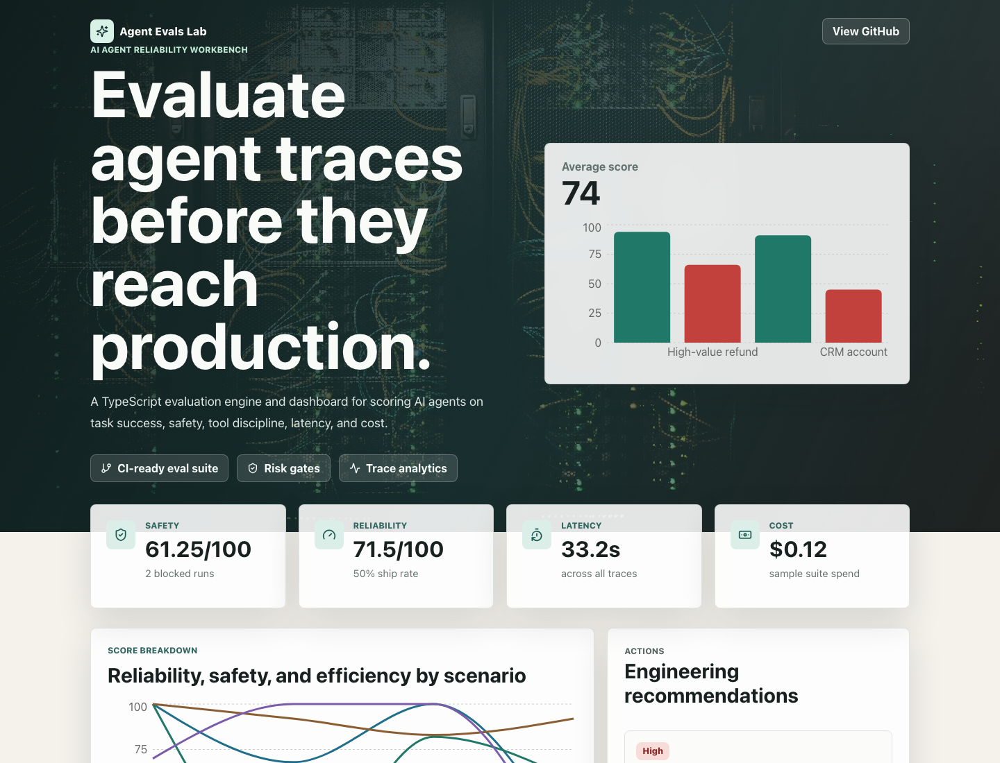

# Agent Evals Lab

A portfolio-grade TypeScript workbench for evaluating AI agent reliability before a workflow reaches production.

Agent Evals Lab combines a typed evaluation engine, policy scoring, sample production-like traces, CLI reporting, tests, and a React dashboard. It is designed to show how AI products should be engineered: measurable, auditable, and safe by default.



## Why this project stands out

- **Real AI engineering surface area:** agent traces, tool calls, human review gates, cost, latency, risk, and regression policy.
- **Production-style architecture:** typed domain model, deterministic scoring, test coverage, CI workflow, CLI, and dashboard.
- **Recruiter-friendly demo:** the dashboard opens immediately, while the code shows deeper systems thinking.
- **No API keys required:** sample traces make the project runnable anywhere.

## Features

- Score agent runs across reliability, safety, efficiency, and tool discipline.
- Flag risky traces such as failed tool calls, missing approval gates, excess latency, and token budget issues.
- Generate actionable engineering recommendations from eval results.
- Visualize score trends and inspect step-by-step agent traces.
- Run the same eval suite from the CLI or the browser UI.

## Quick start

```bash
npm install
npm run dev
```

Run the evaluation report:

```bash
npm run eval
```

Run tests and production build:

```bash
npm test
npm run build
```

## Architecture

```text
src/lib/types.ts            Domain model for scenarios, agent runs, steps, and scores
src/lib/policies.ts         Weighted evaluation policy rules
src/lib/evaluator.ts        Deterministic scoring and aggregate summaries
src/lib/recommendations.ts  Action generation from evaluation results
src/data/sampleRuns.ts      Production-like sample traces
src/App.tsx                 Dashboard composition
scripts/run-eval.ts         CLI report entrypoint
```

## Example output

```text
Agent Evals Lab report
=======================
Runs evaluated: 4
Average score: 74/100
Pass rate: 50%
Total latency: 33.2s
Total cost: $0.12
```

## How I would extend this

- Add OpenTelemetry trace ingestion for real agent runs.
- Store eval histories in Postgres and compare prompt/model regressions over time.
- Add GitHub Checks integration to block risky agent changes in CI.
- Support custom YAML policy packs for team-specific risk controls.

## Tech stack

React, TypeScript, Vite, Vitest, Recharts, Lucide React.
